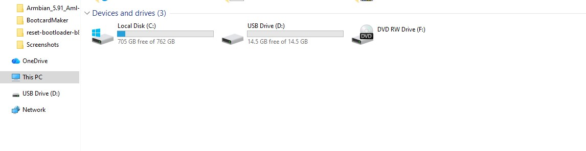
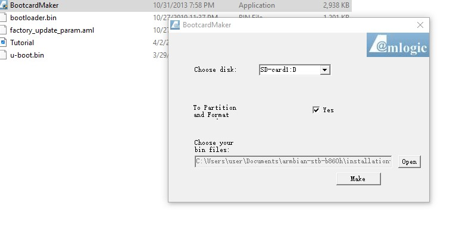
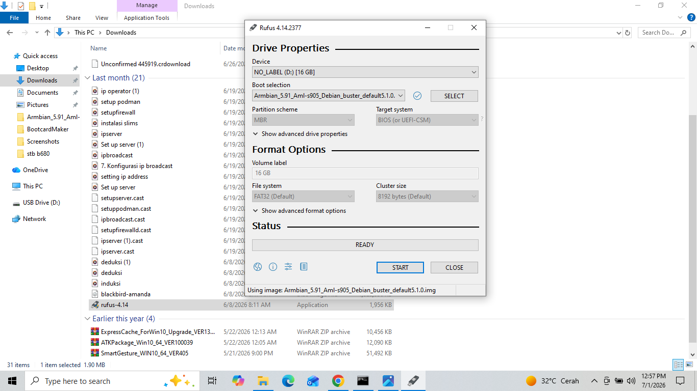
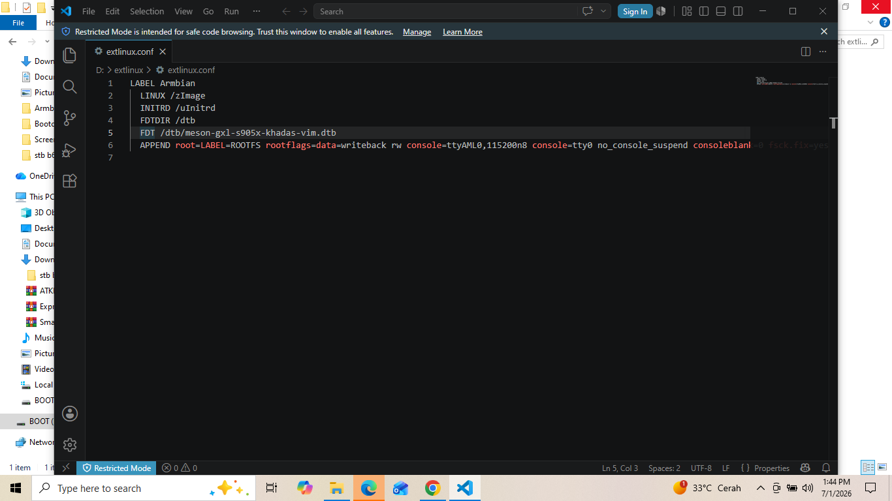
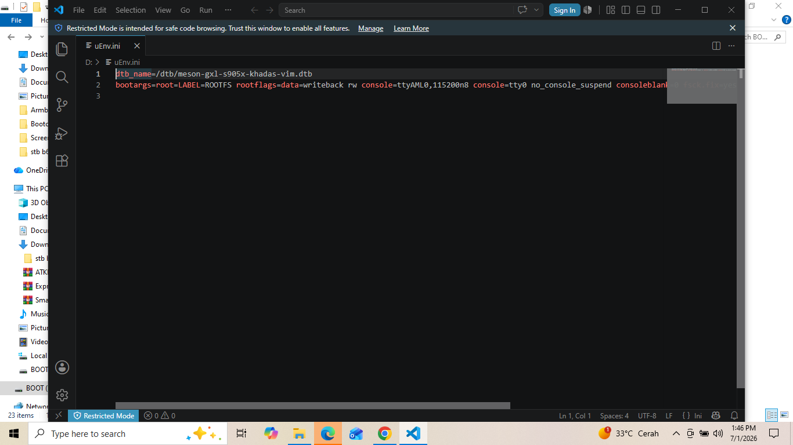

dokumentasi ini di buat atas bantuan dan riset yang telah dilakukan oleh bang sultan fajar dan bang haydar.
kami sangat berterima kasih banyak kepada abang abang atas ilmu dan pengetahuan yang telah diberikan kepada kami.


# Persiapan
- stb b860h
- memorycard minimal 6 gb
- card redear
- usb male to male

## software yang diperlukan 
- usb burning tools https://androidmtk.com/download-amlogic-usb-burning-tool
- boot card maker https://wiki.coreelec.org/coreelec:aml_burncard
- aerofalsher
- rufus
- vscode


- atau silakan donwload [Download](https://drive.google.com/drive/folders/1Rx2OFEo9fwOvBBPcfdYTrjCP4liB_TrQ?usp=sharing)
> catatan harap download semua file diatas

# Step 1
- masukan sd card ke cardreader


- setelah itu masukan ke laptop pastikan sdcard terbaca
kalian dapat mengunakan cardreader seperti di gambar atau cardreader berupa usb

- jika terbaca maka akan muncul di file manager bagian this pc


- setelah itu masuk ke aplikasi bootcardmaker di step ini kita akan memformat sdcard kita agar bisa terbaca dan booting di stb yang kita punya 




- pilih sdcard kita dan centang to partion and format

- setelah itu pilih file yg tadi sudah di download di dalam file boot.bin dan pilih u-boot.bin

- jika sudah berhasil terformatmaka akan ada tulisan sucsesfuly
- setelah itu pindahkan semua file yg ada di boot.bin ke sdcard yg tadi sudah di format
  
# step 2 menyalin firmware
- cabut sdcard dari card reader dan masukan ke dalam slot sdcard stb
- setelah itu masukan sdcard ke stb kita
- lalu buka aplikasi usb burning tools
- sambungkan usb male to male ke komputer dan stb

  
  > catatan penting kalian harus memasukan dan menyalakan usb male to male dan stb serta tombol power di stb secara bersamaan 

- setelah ada di tampilan aplikasi usb burning tools pilih sesuai gambar yaitu import image lalu pilih file Pure-Khadas-VIM1 di step ini kita akan mengganti firmware dengan Pure-Khadas-VIM1


  


  - lalu unceklist erase flash dan erase bootloader yang ada di bagian kanan
  - setelah itu klik start dan tunggu hingga proses nya seratus persen
  - jika gagal maka ulang lagi step nya dari import images
  - Jika masih gagal, ulang dari menyambungkan usb male to male
  - jika berhasil klik stop dan close aplikasinya


  

  - setelah 100% sekarang kita berpindah untuk instal android nya di stb
  - buka file aoreflasher yg tadi sudah di download
  - lalu ketik 2


    
  
  
 - setelah itu cek pada bagian paling atas, apakah sudah ada device yang terscan

- kemudian jika sudah ada, klik spasi

- kemudian tunggu hingga selesai

- setelah selesai, ketik huruf e lalu enter untuk keluar dari terminal


# step 3 mengecek android

- setelah selesai maka step tadi kita sudah berhasil menginstall android di stb kita

- selanjutnya, hubungkan set top box ke monitor atau tv untuk memastikan dengan benar apakah sudah terinstall android di stb 

- lalu kita tunggu hingga selesai booting 

- hubungkan mouse ke set top box

- sambungkan wifi pada android os tv

- maka sudah berhasil menginstall android pada set top box

- lalu keluarkan microsd dari set top box


# step 4 di step ini kita akan mengistall linux arambian di stb

- langkah pertama yakni keluarkan sdcard dari stb
- masukan kembali ke cardreader
- buka aplikasi rufus
- lalu rufus seperti biasa dengan cara memilih ISO Armbian_5.91_Aml-s905_Debian_buster_default5.1.0, jika sudah klik start dan tunggu hingga selesai


    

- jika sudah selesai klik close
- buka microsd di file manager

- kemudian buka folder extlinux

- buka file extlinux.conf menggunakan text editor


> menggunakan visual studio code boleh pake aplikasi teks editor lain
- lalu cari line # FDT /dtb/meson-gxl-s905x-khadas-vim.dtb


    


```extlinux.conf
LABEL Armbian
  LINUX /zImage
  INITRD /uInitrd
  FDTDIR /dtb
#  FDT /dtb/meson-gxl-s905x-khadas-vim.dtb
  APPEND root=LABEL=ROOTFS rootflags=data=writeback rw console=ttyAML0,115200n8 console=tty0 no_console_suspend consoleblank=0 fsck.fix=yes fsck.repair=yes net.ifnames=0 
```
- hapus # dan ganti menjadi FDT /dtb/meson-gxl-s905x-p212.dtb

```extlinux.conf
LABEL Armbian
  LINUX /zImage
  INITRD /uInitrd
  FDTDIR /dtb
  FDT /dtb/meson-gxl-s905x-p212.dtb
  APPEND root=LABEL=ROOTFS rootflags=data=writeback rw console=ttyAML0,115200n8 console=tty0 no_console_suspend consoleblank=0 fsck.fix=yes fsck.repair=yes net.ifnames=0 
```


- setelah itu kita save


- setelah itu kita pindah ke file uENV.ini kita edit lagi di vscode > bisa pake aplikasi lain


    
  
```uENV.ini
dtb_name=/dtb/meson-gxl-s905x-khadas-vim.dtb
bootargs=root=LABEL=ROOTFS rootflags=data=writeback rw console=ttyAML0,115200n8 console=tty0 no_console_suspend consoleblank=0 fsck.fix=yes fsck.repair=yes net.ifnames=0
```

- lalu ganti menjadi dtb_name=/dtb/meson-gxl-s905x-p212.dtb

```uENV.ini
dtb_name=/dtb/meson-gxl-s905x-p212.dtb
bootargs=root=LABEL=ROOTFS rootflags=data=writeback rw console=ttyAML0,115200n8 console=tty0 no_console_suspend consoleblank=0 fsck.fix=yes fsck.repair=yes net.ifnames=0
```

- selanjutnya kita kembali ke android pada set top box, kita bisa menggunakan mouse

- lalu buka file manager

- klik tombol sebelah icon home untuk bisa memilih file

- kemudian cari file bootloader.bin

- setelah itu klik, 2 tombol dari icon home untuk bisa menyalin file yang telah dipilih

- lalu pencet tombol icon home

- buka folder localdisk

- kemudian buka folder Download

- klik logo pensil yang ada di icon home
  
- pilih paste
  
- setelah itu buka aplikasi emulator terminal

- kemudian masuk ke dalam root dengan menggunakan command 

```
su
```

- setelah itu masuk ke folder download pada localdisk

```
cd sdcard/download
```

- lalu cek apakah ada file bootloadet.bin

```
ls
```

- kemudian masukkan command berikut

```
dd if=bootloader.bin of=/dev/block/bootloader
```

- jika berhasil maka akan keluar records in dan records out

- setelah itu restart set top box 

```
reboot
```
- setelah itu masukan pw root 1234

- setelah itu akan diminta untuk mengubah password root

- untuk mengubah password root akan diminta password yang awal

- kemudian masukkan password yang diinginkan, setelah itu masukkan kembali password yang baru

- setelah itu kita akan membuat user

- kemudian masukkan password baru yang sudah dibuat untuk user

- setelah itu kita akan diminta informasi masukkan saja sesuai keinginan atau bisa dikosongkan dengan cara langsung dienter saja

**selamat anda telah berhasil menginstall linux pada set top box**


  
