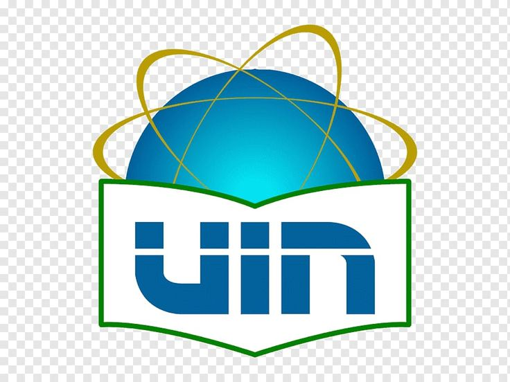

**<h1 align="center">TEKNOLOGI SEBAGAI MITOS DAN HIPERREALITAS : Analisis dalam Perspektif Pengalaman Personal</h1>** 

Diajukan untuk memenuhi tugas Mata Kuliah
Perpustakaan dan Arsip Digital  

**
Dosen Pengampu:**  
**Al Muhdil Karim, S.IP., M.Hum**

---

	  

**
Disusun Oleh:**  
Kelompok 2

Fathan Rangga Ifari (12402051030098) 
Shabrina Zulfa (12402051010024) 
Sumayyah Syahidah (12402051010021)

**
PROGRAM STUDI ILMU PERPUSTAKAAN**  
**FAKULTAS ADAB DAN HUMANIORA**  
**UIN SYARIF HIDAYATULLAH JAKARTA**  
**1447 H / 2026 M**

---

**
DAFTAR ISI
**

Kata Pengantar

BAB I PENDAHULUAN 

1.1 Latar Belakang

1.2 Rumusan Masalah

1.3 Tujuan 

BAB II PEMBAHASAN

2.1 Posisi Teknologi Sebagai Mitos 

2.2 Subtansi Teknologi dalam Sudut Pandang Hiperrealitas

2.3 Contoh kasus berdasarkan pengalaman pribadi terkait konsep teknologi dalam sudut pandang hiperrealitasasi

2.4 Perbedaan antara teknologi sebagai mitos dan teknologi alat menggunakan pengalaman internal dan terpersonalisasi

BAB III PENUTUP

3.1 Kesimpulan 

DAFTAR PUSTAKA

---

# KATA PENGANTAR

Puji syukur kami panjatkan kepada Allah SWT atas limpahan rahmat dan karunia-Nya sehingga makalah yang berjudul **“Teknologi sebagai Mitos dan Hiperrealitas: Analisis dalam Perspektif Pengalaman Personal”** ini dapat diselesaikan dengan baik dan kami berhasil mengatasi berbagai kendala yang dihadapi selama proses Analisis, sehingga makalah ini dapat disusun secara menyeluruh dan sesuai dengan jadwal yang telah ditentukan.

Makalah ini disusun untuk memenuhi tugas serta sebagai upaya memahami lebih dalam mengenai bagaimana teknologi tidak hanya berfungsi sebagai alat, tetapi juga dapat dipandang sebagai mitos dan bagian dari hiperrealitas dalam kehidupan modern. Kami berusaha mengkaji konsep tersebut melalui pendekatan teoritis serta refleksi pengalaman pribadi.

Kami menyadari bahwa makalah ini masih memiliki banyak kekurangan, baik dari segi isi maupun penyusunan. Oleh karena itu, kami sangat mengharapkan kritik dan saran yang membangun demi perbaikan di masa yang akan datang.

Akhir kata, kami berharap makalah ini dapat memberikan manfaat serta menambah wawasan bagi pembaca.

---

# BAB I PENDAHULUAN

## 1.1 Latar Belakang

Perkembangan teknologi di era modern telah membawa perubahan besar dalam berbagai aspek kehidupan manusia. Teknologi tidak lagi sekadar dipahami sebagai alat bantu untuk mempermudah aktivitas, tetapi telah berkembang menjadi sesuatu yang memengaruhi cara berpikir, berinteraksi, dan memaknai realitas.

Dalam kajian kritis, teknologi dapat dipandang sebagai mitos, yaitu sesuatu yang dianggap memiliki kekuatan besar dan sering kali diterima tanpa dipertanyakan. Masyarakat cenderung memandang teknologi sebagai solusi atas berbagai permasalahan, sehingga menempatkannya pada posisi yang hampir tidak tergantikan.

Selain itu, dalam perspektif hiperrealitas, teknologi berperan dalam menciptakan realitas semu yang terkadang lebih dipercaya daripada realitas itu sendiri. Kehadiran media sosial, simulasi digital, dan representasi virtual membuat batas antara kenyataan dan konstruksi menjadi semakin kabur.

Fenomena ini juga dapat dirasakan secara personal dalam kehidupan sehari-hari, di mana individu sering kali terlibat dalam pengalaman yang sulit dibedakan antara yang nyata dan yang direkayasa oleh teknologi. Oleh karena itu, penting untuk memahami bagaimana teknologi bekerja tidak hanya sebagai alat, tetapi juga sebagai mitos dan bagian dari hiperrealitas.

Berdasarkan hal tersebut, makalah ini akan membahas posisi teknologi sebagai mitos, substansinya dalam perspektif hiperrealitas, contoh pengalaman personal, serta perbedaan antara teknologi sebagai mitos dan sebagai alat.

---

## 1.2 Rumusan Masalah

- Bagaimana posisi teknologi sebagai mitos?  
- Bagaimana substansi teknologi dalam sudut pandang hiperrealitas?  
- Bagaimana contoh pengalaman pribadi terkait hiperrealitas?  
- Apa perbedaan teknologi sebagai mitos dan sebagai alat?  

---

## 1.3 Tujuan

- Untuk menjelaskan posisi teknologi sebagai mitos.
- Untuk memahami substansi teknologi dalam perspektif hiperrealitas.
- Untuk memberikan contoh kasus berdasarkan pengalaman pribadi terkait konsep teknologi dalam sudut pandang hiperrealitas.
- Untuk menjelaskan perbedaan antara teknologi sebagai mitos dan teknologi sebagai alat berdasarkan pengalaman internal dan personal.
  
---

# BAB II PEMBAHASAN

## 2.1 Posisi Teknologi Sebagai Mitos

Seorang sosiolog yang bernama Lewis Mumford memperkenalkan konsep The Myth of the Machine dimana beliau mengeksplorasi perkembangan teknologi dan hubungannya dengan masyarakat manusia. Mumford berpendapat bahwa mesin bukan hanya alat tetapi bagian dari sistem sosial yang lebih besar yang dapat membentuk dan mengendalikan perilaku manusia. Manusia akan menjadi hewan yang pasif, tanpa tujuan, dan terkondisi oleh mesin.

Menurut Neil Postman, sebagian besar orang percaya bahwa teknologi adalah teman yang setia. Ada dua alasan untuk ini. Pertama, teknologi membuat hidup lebih mudah, lebih bersih, dan lebih panjang. Kedua, karena hubungannya yang panjang, intim, dan tak terhindarkan dengan budaya, teknologi tidak mengundang pemeriksaan mendalam terhadap konsekuensinya sendiri. Namun, tentu saja, ada sisi gelap dari teman ini. Pertumbuhan teknologi yang tidak terkendali dapat menghancurkan sumber-sumber vital kemanusiaan kita. Teknologi menciptakan budaya tanpa landasan moral. Teknologi merusak proses mental dan hubungan sosial tertentu yang membuat kehidupan manusia layak dijalani. Singkatnya, teknologi adalah teman sekaligus musuh.

Technopoly adalah suatu keadaan budaya. Technopoly juga merupakan suatu keadaan pikiran. Teknologi terdiri dari pendewaan teknologi, yang berarti bahwa budaya mencari otorisasi dalam teknologi, menemukan kepuasan dalam teknologi, dan menerima perintah dari teknologi. Mereka yang merasa paling nyaman di Technopoly adalah mereka yang yakin bahwa kemajuan teknologi adalah pencapaian tertinggi umat manusia dan instrumen yang dengannya dilema kita yang paling mendalam dapat dipecahkan. Mereka juga percaya bahwa informasi adalah berkah yang murni, yang melalui produksi dan penyebarannya yang berkelanjutan dan tidak terkendali menawarkan peningkatan kebebasan, kreativitas, dan ketenangan pikiran. 

Menurut Martin Heidegger, teknologi bukanlah sekadar alat. Teknologi adalah cara untuk mengungkapkan. Jika kita memperhatikan hal ini, maka ranah lain yang sepenuhnya berbeda karena esensi teknologi akan terbuka bagi kita. Itu adalah ranah pengungkapan, yaitu kebenaran.

---

## 2.2 Subtansi Teknologi dalam Persfektif Hiperrealitas

Sebelum kita membahas lebih jauh mengenai substansi teknologi dalam sudut pandang hiperrealitas, perlu diketahui makna dari hiperralitas itu sendiri.  Menurut Jean Baudrillard, hiperrealitas adalah keadaan dimana yang palsu terlihat lebih nyata darpada kenyataan yang sebenarnya. Masyarakat pascamodern ini pun tidak terelakkan dari realitas yang telah digantikan oleh “Simulacra” dan dapat dimaknai sebagai gambar atau simbol yang awalnya meniru kenyataan, tetapi lama kelamaan dianggap  sebagai kenyataan itu sendiri. Tatanan dunia yang hipereal atau hiperrealitas ini diciptakan oleh simulasi itu sendiri.

Pada masa perkembangan peradaban modern dimana fungsi teknologi berubah dari hanya alat bantu manusia menjadi kekuatan utama yang membentuk cara manusia memahami dan mengalami realitas. Dalam pembahasan kali ini subtansi teknologi mengacu pada peran mendasar teknologi dalam kehidupan manusia terhadap perilaku, pola pikir, serta proses pembentukan realitas sosial.

Simulakra tahap pertama ditandai oleh perkembangan perangkat lunak atau software oleh Bill Gates dan Paul Allen, dimana komputer telah menjadi mesin yang menjalan model dunia (angka, kata, kalkulasi). Software disini adalah generalisasi dari proses berpikir manusia yang kemudian generalisasi itu menjadi lebih asli daripada proses berpikir itu sendiri. Daripada menciptakan alat bantu, Bill Gates telah menciptakan realitas baru berbasis kode serta menhilangkangkan ambiguitas kemanusiaan.

Simulakra tahap dua dapat dilihat saat kemunculan Altair, Apple, hingga IBM PC yang berhasil menghadirkan komputer di tangan individu. Dinamika yang terjadi adalah komputer tidak lagi hanya berfungsi sebagai alat bantu yang bernilai guna, tetapi bergeser fungsi menjadi nilai tukar dan simbol identitas yang meyebabkan terdistorsinya realitas fisik melalui pencitraan gaya hidup.

Isaacson menekankan bahwa internet secara teknis merupakan perwujudan dari rancangan hiperrealitas karena strukturnya yang terdesentralisasi dan tidak memiliki referensi asli. Internet sebagai mesin hiperrealitas pertama beroprasi menjadi jaringan dimana setiap konten hanya mengacu pada konten lainnya sehingga setiap informasi adalah metadata dari informasi lainnya tanpa adanya titik awal makna yang tetap.

Kemunculan algoritma PageRank pada Google memperkuat definisi simulakra itu sendiri , dimana yang menentukan kebenaran digital bukan atas dasar isi konten, tetapi melalui sirkulasi dan konsensus tanda. Sehingga suatu informasi dianggap penting hanya karena banyaknya tautan yang mengacu kepadanya.

Wikipedia adalah salah satu contoh kontemporer dari pengetahuan manusia yang tidak stabil karena tidak ada otoritas tunggal. Wikipedia berfungsi sebagai referensi tanpa original yang mengambang karena ia merupakan produk dari produksi rekanan berbasis sumber daya bersama. Wikipedia telah menjadi fakta atau referensi utama yang membangun sudut pandang masyarakat terhadap realitas. Oleh karena itu, dalam kasus ini informasi telah berhasil menggeser posisi realitas objektif dengan konsensus tanda yang terus berubah.

---

## 2.3 Contoh Kasus Berdasarkan Pengalaman Pribadi Terkait Konsep Teknologi Dalam Sudut Pandang Hiperrealitas

1. Dalam kehidupan sehari-hari, saya sering menggunakan media sosial seperti Instagram untuk berinteraksi dan melihat kehidupan orang lain. Awalnya, saya menganggap apa yang ditampilkan di media sosial adalah gambaran nyata dari kehidupan seseorang. Namun, seiring waktu saya menyadari bahwa banyak konten yang sebenarnya telah dikurasi, diedit, bahkan direkayasa agar terlihat lebih menarik.

Misalnya, ketika melihat unggahan teman yang tampak selalu bahagia, produktif, dan memiliki kehidupan yang “sempurna”, saya sempat merasa bahwa kehidupan saya tertinggal atau kurang menarik. Padahal, setelah berinteraksi langsung, ternyata kehidupan mereka tidak selalu seperti yang ditampilkan di media sosial. Ada banyak sisi yang tidak diperlihatkan, seperti masalah pribadi, tekanan, atau kegagalan.

2. Adapun sebagai seorang player game genshin impact,  setiap kali mendapat story quest, saya ikut merasa emosional, baik sedih dan senangnya. Padahal story quest dari game hanya menampilkan karakter yang aslinya hanya merupakan deretan kode digital. Ternyata ini disebut simulakra yang menciptakan hiperrealitas itu.

Terus sama kalau di komunitas lagi ada pembahasan karakter paling op, nah top tier list nya itu diambil dari trending medsos berdasarkan sistem dan bukan dari hasil trial individu. Mirip banget sama sistem PageRank nya Google. Kalau dipikir-pikir game ini jadi mesin hiperrealitas tempat saya nyari makna di tengah jaringan tanda-tanda yang sebenarnya nggak punya referensi asli di dunia nyata.

## 2.4 Perbedaan Antara Teknologi Sebagai Mitos dan Teknologi Sebagai Alat Berdasarkan Pengalaman Internal dan Personal

Apa sih perbedaan antara teknologi sebagai mitos dan teknologi sebagai alat berdasarkan pengalaman internal dan personal,? berdasarkan pembahasan dalam buku Technopoly, perbedaan antara teknologi sebagai mitos dan teknologi sebagai alat dapat dipahami dari bagaimana manusia memaknai dan mengalami teknologi dalam kehidupannya.

Teknologi sebagai alat dipahami sebagai sesuatu yang bersifat praktis dan fungsional. Dalam tahap awal perkembangan budaya, teknologi diciptakan untuk membantu manusia menyelesaikan masalah tertentu, seperti memenuhi kebutuhan hidup atau mendukung aktivitas sosial dan budaya.  Dalam kondisi ini, teknologi masih berada di bawah kendali manusia dan nilai-nilai budaya. Dengan kata lain, manusia menggunakan teknologi secara sadar sebagai sarana untuk mencapai tujuan tertentu.

Dalam pengalaman personal, teknologi sebagai alat terlihat ketika seseorang menggunakan perangkat seperti komputer atau ponsel hanya sebagai media untuk bekerja, belajar, atau berkomunikasi. Teknologi tidak mengubah cara berpikir secara mendasar, melainkan hanya membantu aktivitas yang sudah ada.

Sebaliknya, teknologi sebagai mitos muncul ketika teknologi tidak lagi dipandang sekadar alat, tetapi sudah menjadi sesuatu yang dipercaya secara absolut, seolah-olah memiliki kekuatan untuk menentukan kebenaran, realitas, dan bahkan kehidupan manusia. Dalam kondisi ini, manusia tidak lagi mempertanyakan teknologi, melainkan menerimanya sebagai otoritas.

Dalam buku ini dijelaskan bahwa teknologi dapat mengubah cara manusia memahami dunia, termasuk makna “kebenaran”, “pengetahuan”, dan “realitas”. Hal ini menunjukkan bahwa teknologi tidak netral, tetapi membawa ideologi tertentu yang secara perlahan membentuk cara berpikir manusia.

Dalam pengalaman internal (cara berpikir), teknologi sebagai mitos terlihat ketika seseorang:
- Lebih percaya pada hasil komputer daripada penilaian sendiri
- Menganggap data atau angka sebagai kebenaran mutlak
- Merasa bahwa semua masalah dapat diselesaikan dengan teknologi 

Bahkan dalam konteks sosial, keputusan sering diterima begitu saja hanya karena “komputer mengatakan demikian”, tanpa mempertanyakan proses di baliknya.

Dalam pengalaman personal sehari-hari, hal ini dapat terlihat ketika:
1. Seseorang merasa tidak bisa hidup tanpa teknologi
2. Identitas diri dibentuk melalui media digital
3. Realitas digital terasa lebih penting daripada realitas langsung

Pada tahap ini, teknologi tidak lagi sekadar digunakan, tetapi justru mengendalikan cara manusia berpikir dan bertindak. Inilah yang oleh Neil Postman disebut sebagai kondisi Technopoly, yaitu ketika budaya menyerahkan dirinya sepenuhnya kepada teknologi. 

---

# BAB III PENUTUP

## 3.1 Kesimpulan

Dapat disimpulkan bahwa perkembangan teknologi di era modern tidak lagi sekadar dipahami sebagai alat bantu, tetapi telah berkembang menjadi sesuatu yang memengaruhi cara berpikir, berinteraksi, dan memaknai realitas. Teknologi dapat dipandang sebagai mitos, yaitu sesuatu yang dianggap memiliki kekuatan besar dan sering kali diterima tanpa dipertanyakan, sehingga masyarakat cenderung menempatkannya pada posisi yang hampir tidak tergantikan.

Dalam perspektif hiperrealitas, teknologi berperan dalam menciptakan realitas semu yang terkadang lebih dipercaya daripada realitas itu sendiri. Kehadiran media sosial, simulasi digital, dan representasi virtual membuat batas antara kenyataan dan konstruksi menjadi semakin kabur. Hal ini menunjukkan bahwa teknologi tidak hanya berfungsi sebagai alat, tetapi juga membentuk cara manusia memahami dunia.

Dalam kehidupan sehari-hari, teknologi sebagai alat terlihat ketika digunakan untuk bekerja, belajar, atau berkomunikasi tanpa mengubah cara berpikir secara mendasar. Sebaliknya, teknologi sebagai mitos muncul ketika teknologi dipercaya secara absolut, dianggap sebagai kebenaran, dan tidak lagi dipertanyakan, sehingga mampu mengendalikan cara manusia berpikir dan bertindak.

Pada tahap ini, teknologi tidak lagi sekadar digunakan, tetapi justru mengendalikan kehidupan manusia. Kondisi ini disebut sebagai Technopoly, yaitu ketika budaya menyerahkan dirinya sepenuhnya kepada teknologi. Oleh karena itu, penting bagi manusia untuk memahami teknologi secara kritis agar tidak sepenuhnya terjebak dalam mitos dan hiperrealitas yang diciptakan oleh teknologi.

---

# DAFTAR PUSTAKA

Anggoro, B. D., Krisnanda, V. S., Wijayaputra, Y. I. A., & Prasojo, A. A. (2025). *Hiperrealitas orang muda di era digital dalam perspektif Jean Baudrillard*. Prosiding Seri Filsafat Teologi, 35(34), 262–282.

Heidegger, M. (1993). *The question concerning technology*.

Isaacson, W. (2014). *The innovators: How a group of hackers, geniuses, and geeks created the digital revolution*. New York: Simon & Schuster.

Postman, N. (2011). *Technopoly: The Surrender of Culture to Technology*. New York: Vintage Books.
