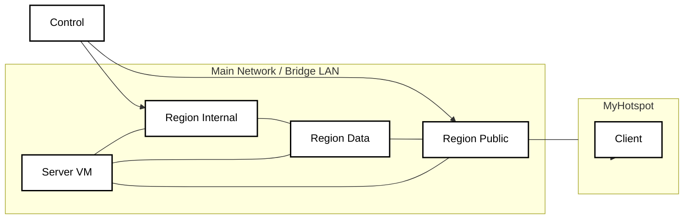

# Network Configuration

## Network Overview

Topologi jaringan menggunakan **dua buah network interface** pada **Region Public**.

Interface pertama terhubung ke **Main Network (Bridge/LAN)** yang sama dengan **Region Internal** dan **Region Data**. Jaringan ini digunakan sebagai jalur komunikasi antar server sehingga setiap region dapat saling bertukar data dan menjalankan layanan internal.

Interface kedua dikonfigurasi sebagai **MyHotspot**, yang berfungsi sebagai jaringan khusus untuk **Client**. Melalui jaringan ini, Client hanya dapat mengakses layanan yang tersedia pada **Region Public**, tanpa memiliki akses langsung ke **Region Internal** maupun **Region Data**.

Pemisahan jaringan ini bertujuan untuk meningkatkan keamanan sistem dengan membatasi akses pengguna hanya pada layanan publik yang disediakan.

---

## Network Structure

| Network | Description |
|----------|-------------|
| **Main Network (Bridge/LAN)** | Digunakan sebagai jaringan utama yang menghubungkan **Region Internal**, **Region Data**, dan **Region Public** sehingga seluruh layanan internal dapat saling berkomunikasi. |
| **MyHotspot** | Digunakan sebagai jaringan khusus bagi **Client** untuk mengakses layanan pada **Region Public** tanpa dapat mengakses jaringan internal maupun database secara langsung. |

---

## Network Roles

### Region Internal
- Digunakan untuk administrasi dan pengelolaan sistem.
- Berkomunikasi langsung dengan Region Data dan Region Public melalui Main Network.

### Region Data
- Menyediakan layanan basis data seperti:
  - MariaDB

