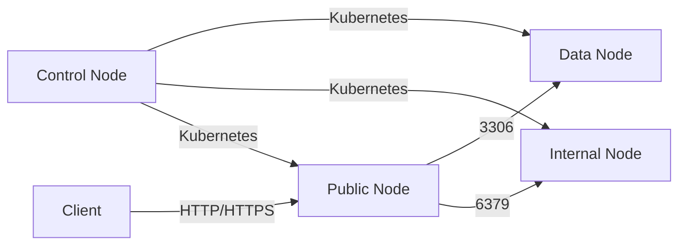

**Kelompok Sagitarius**
   


### Cluster

| Device | Role | Fungsi |
|---------|------|--------|
| Control | K3s Server / Master | Mengelola seluruh cluster Kubernetes |
| Data | Worker Node | Menjalankan MariaDB sebagai Database |
| Internal | Worker Node | Menjalankan Redis/Valkey sebagai Cache & Session |
| Public | Worker Node | Menjalankan aplikasi SLiMS dan Web Server |
| Client | User | Mengakses aplikasi melalui browser |

### Alur Komunikasi
```
Client
   │
HTTP/HTTPS
   │
   ▼
Public (SLiMS)
   ├────────► MariaDB
   └────────► Redis / Valkey

Control
   ├────────► Data
   ├────────► Internal
   └────────► Public
```
 ### Network

| Device | IP Address | Fungsi |
|---------|------------|--------|
| Control | 10.171.181.168 | Cluster Management |
| Data | 10.171.181.53 | Database |
| Internal | 10.171.181.22 | Cache |
| Public | 10.171.181.224 | Web Server |
| Client | | Browser |
```
   Control (K3s)
    ├────────► Data (MariaDB)
    ├────────► Internal (Redis)
    └────────► Public (SLiMS)
                        ▲
                        │
                 HTTP / HTTPS
                        │
                     Client
```
# Network yang Digunakan

## Jenis Network

Implementasi menggunakan **Local Area Network (LAN)** dengan arsitektur **Client-Server** dan cluster **Kubernetes (K3s)**.

1. Network Type : Local Area Network (LAN)
2. Kubernetes : K3s Cluster
3. Container Runtime : containerd (default K3s)
4. Image : Podman

## Topologi Network




### Alur Komunikasi
1. Control Node mengelola seluruh worker melalui Kubernetes API (Port 6443).
2. Public Node menjalankan aplikasi SLiMS.
3. Public Node mengakses database pada Data Node melalui MariaDB (Port 3306).
4. Public Node menggunakan Redis/Valkey pada Internal Node sebagai cache dan session (Port 6379).
5. Client hanya dapat mengakses Public Node menggunakan HTTP/HTTPS.
